# Allen Brain  analysis and visualization

This repository contains notebooks and scripts used for exploring and visualizing Allen Institute datasets and related electrophysiology / Patch-seq examples. It collects code and generated figures for cell-type analyses, Patch-seq metrics, and electrophysiology demonstrations.

## Quick start

- Create a Python environment (recommended: venv or conda)
- Install dependencies:

```powershell
pip install -r requirements.txt
```

- Run example scripts (from the repository root):

```powershell
python scripts/run_all_scripts.py
# or run individual scripts under `scripts/` or `scripts/<subfolder>/`
```

## Notable files

- `requirements.txt`  minimal packages used by notebooks and scripts.
- `scripts/`  runnable Python scripts that mirror many of the analyses in the notebooks.
- `*.ipynb`  Jupyter notebooks with interactive analysis and plots (see top-level folders like `allen_25`, `cell_type`, `electroscopy`).

## How this README was generated

This README was populated to provide a concise overview and to embed the project's generated figures (located in the `figures/` folder). If you generate new figures, add them to `figures/` and update this README or enable a script to regenerate the README automatically.

## Figures

Below are representative figures generated by scripts and notebooks in this repo. Each image is stored in `figures/`.

### Cell types

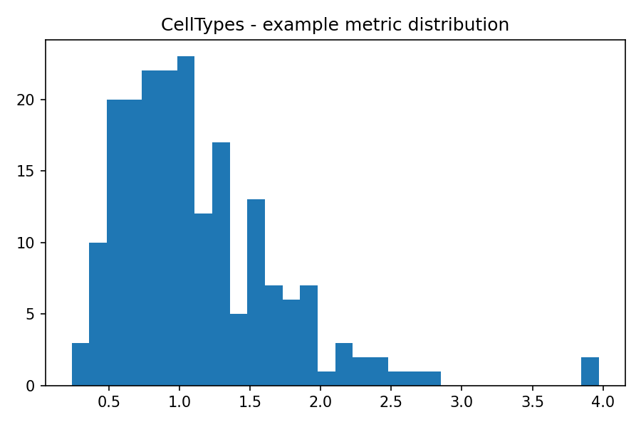

_Example histogram of a cell metric across cell types._

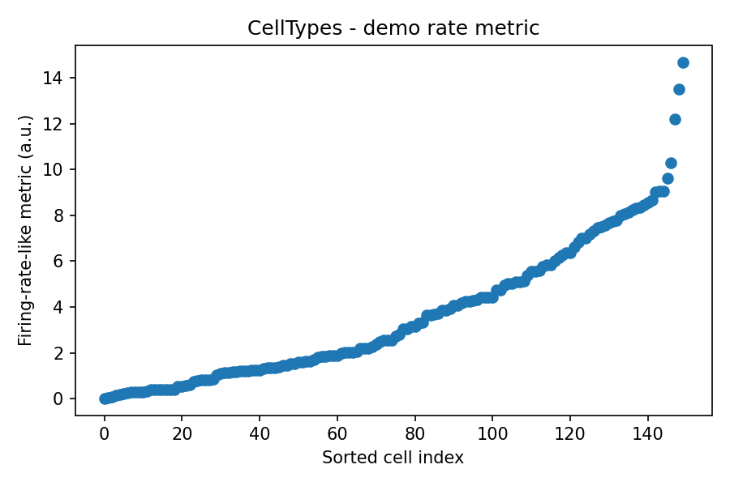

_Scatter comparing firing rates and an example metric by cell type._

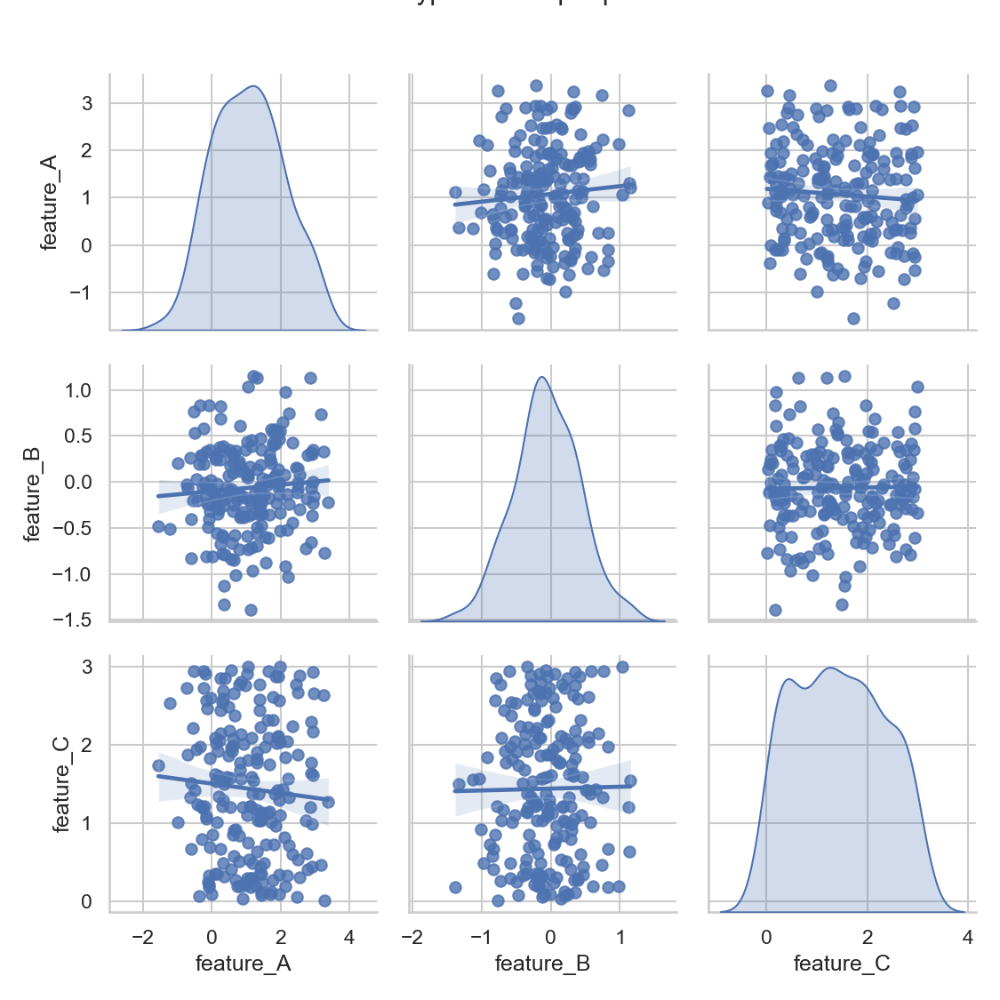

_Pairwise comparison of selected features used for cell-type clustering._

### Electrophysiology

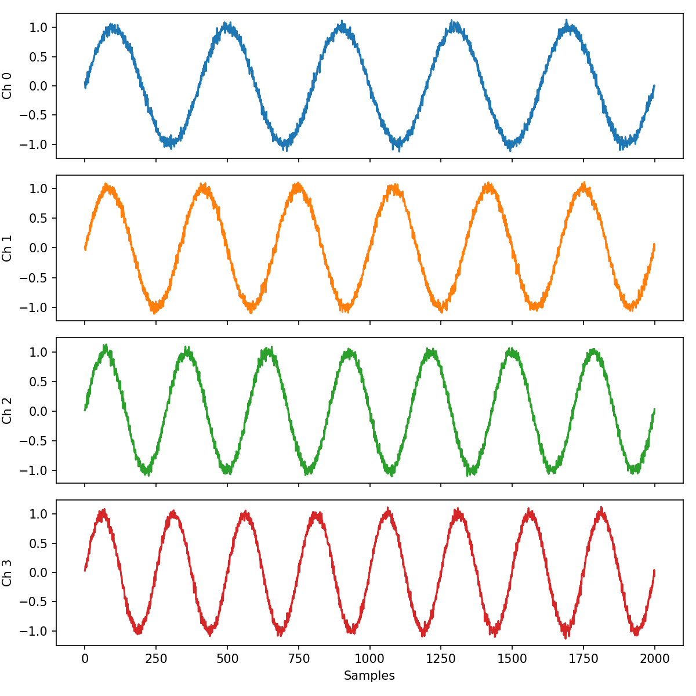

_Example BYB recording plot used in electrophysiology demonstrations._

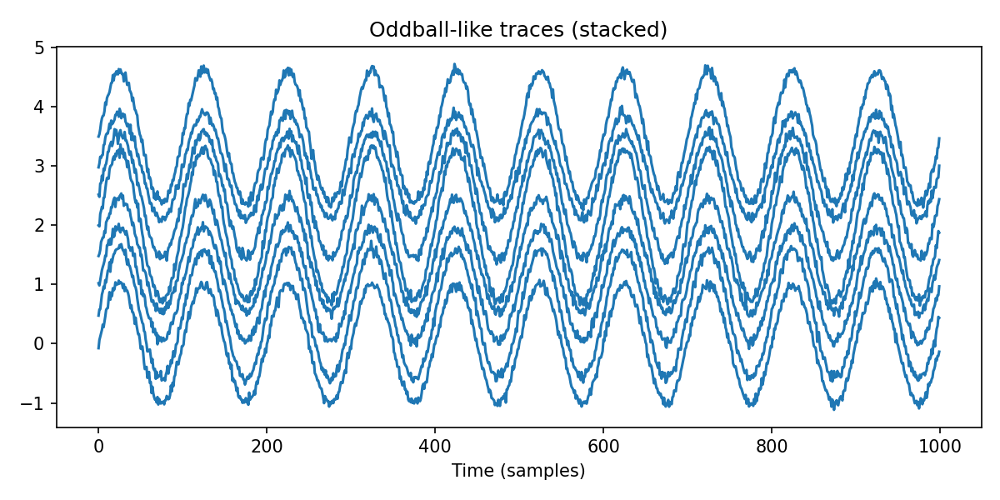

_Evoked response traces for an oddball experiment._

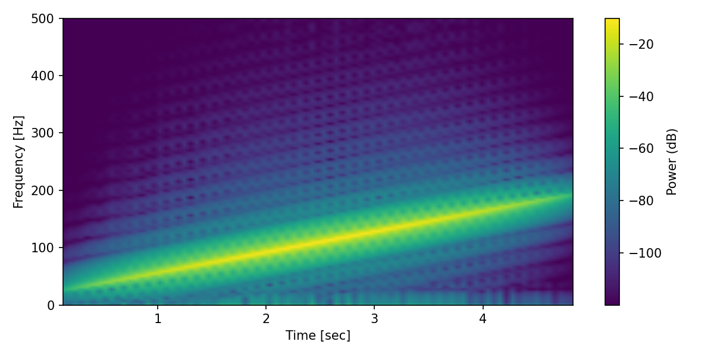

_Spectrogram visualization of an example recording._

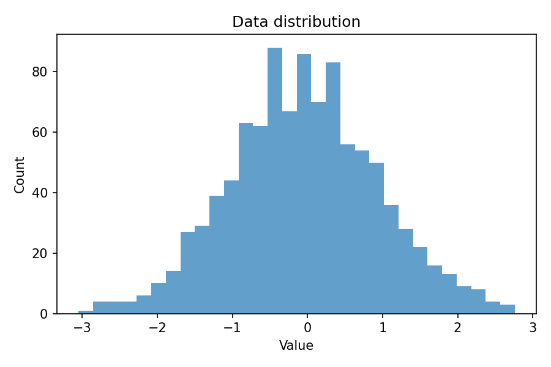

_Distribution of a key electrophysiology statistic across recordings._

### Patch-seq

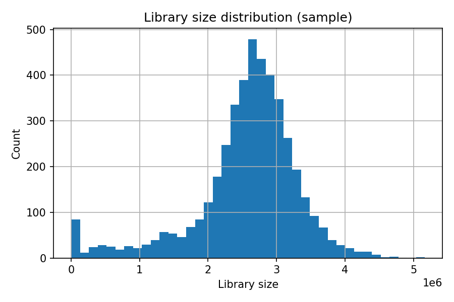

_Library size distribution for Patch-seq samples._

### Tutorials & Demos

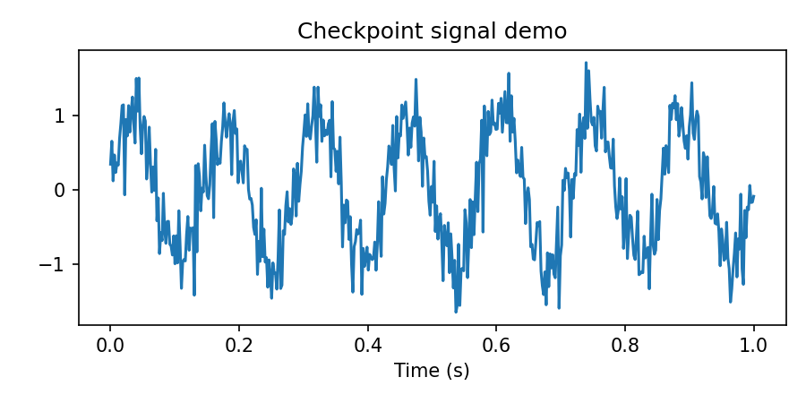

_Checkpoint signal plot used in tutorial notebooks._

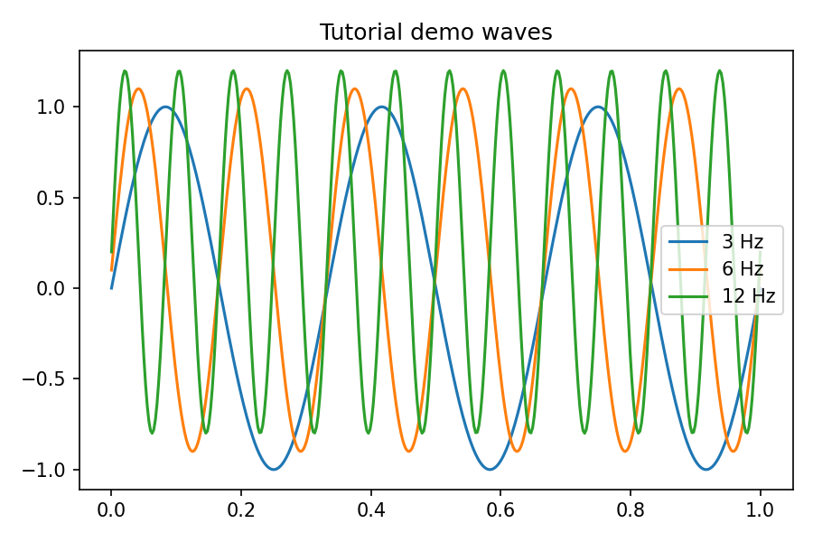

_Simple synthetic signal example used by tutorial code._

### Brain Observatory demo

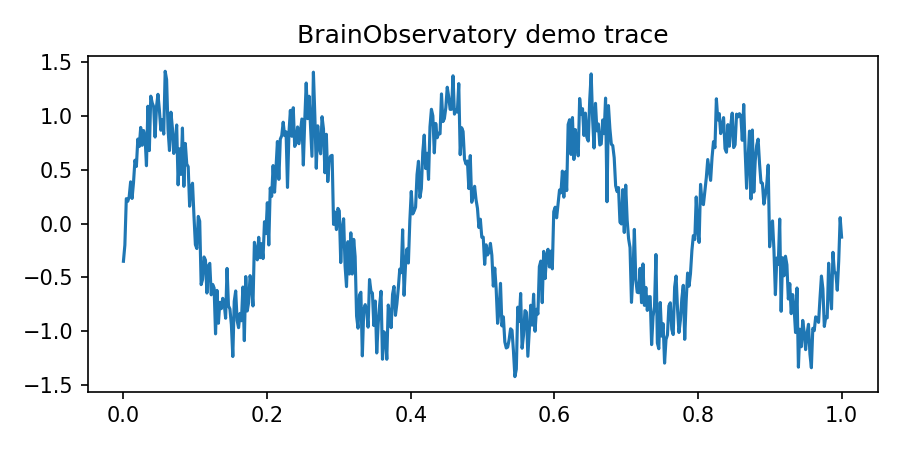

_Example trace from the Brain Observatory demo notebook._

## Contributing

If you add or regenerate figures, please place them in the `figures/` folder and consider updating this README to include them. Pull requests with additional examples or small docs are welcome.

## License

This repository contains educational and analysis code. No license file is included in the repo root  if you intend to redistribute or publish, add an appropriate `LICENSE` file.
